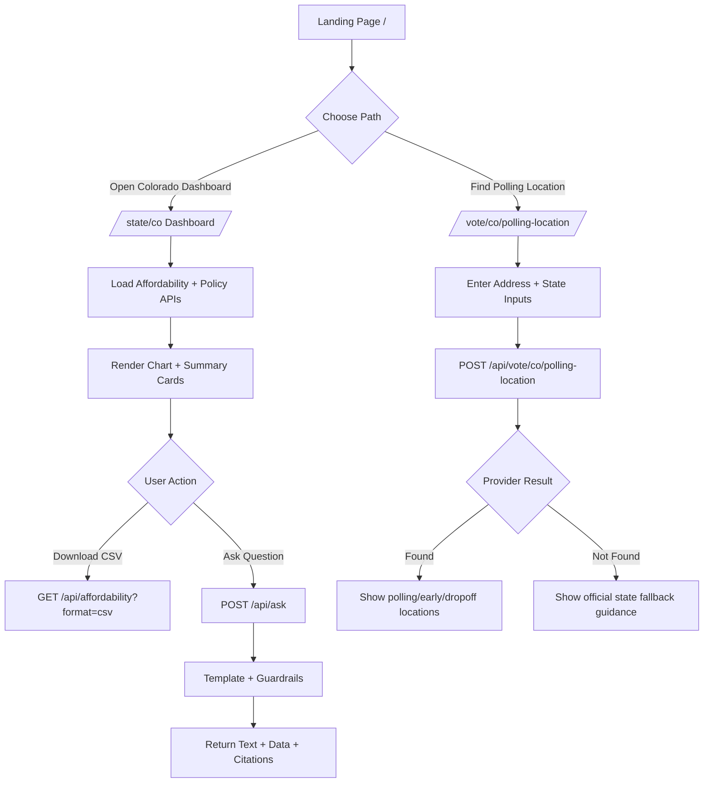
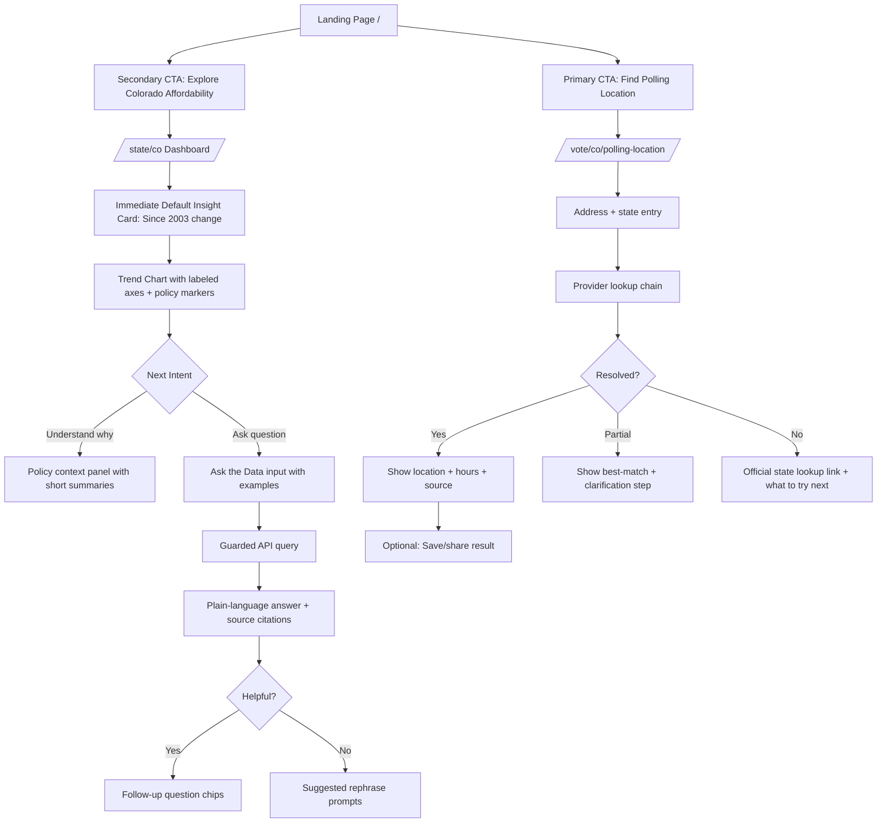

# Civic Affordability User Flow

This document captures:
- the **current implemented flow** (based on existing routes/components)
- a **proposed improved flow** using proven UX patterns (fast first value, guided actions, clear recovery states)

## 1) Current Implemented Flow

## 2) Improved Flow (Recommended)

## 3) Why This Improved Flow Performs Better

- Reduces time-to-value with a default insight card before users need to ask.
- Uses clear branching for success, partial, and failure states in polling lookup.
- Adds guided follow-ups in Ask flow to reduce dead-end responses.
- Keeps outputs human-readable (plain language + source citations) for trust.
- Preserves your existing architecture and routes; this is mostly UX/interaction polish.
